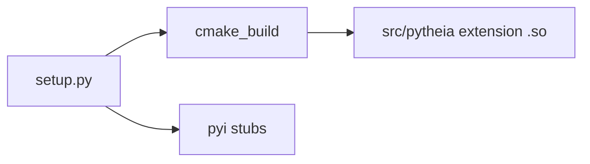

# AGENTS.md — pyTheiaSfM

Guidance for automated coding agents and contributors working in this repository.

## What this project is

**pyTheia** exposes [TheiaSfM](http://www.theia-sfm.org) to Python via **pybind11**. The C++ library lives under [`src/theia/`](src/theia/) (SfM pipelines, cameras, bundle adjustment, geometric vision solvers, etc.).

- **Public import:** `import pytheia as pt`
- **Native module:** `pytheia.pytheia` — the compiled extension. [`src/pytheia/__init__.py`](src/pytheia/__init__.py) re-exports `io`, `math`, `matching`, `mvs`, `sfm`, `solvers`.

The [README](README.md) states that **interfaces are still evolving**. Prefer backward-compatible Python API changes; when you change bindings or signatures, **regenerate or hand-update stubs** and keep docs/examples consistent.

**Scope:** pyTheia is not a full end-to-end SfM product. Feature detection, matching, and image preprocessing are intentionally left to the application (see README “Differences to the original library TheiaSfM”).

## Repository map

| Area | Path | Notes |
|------|------|--------|
| Core Theia C++ | [`src/theia/`](src/theia/) | Algorithms, `Reconstruction`, cameras, BA, etc. |
| Python bindings | [`src/pytheia/`](src/pytheia/) | [`pytheia_pybind.cc`](src/pytheia/pytheia_pybind.cc), [`pytheia_pybind.h`](src/pytheia/pytheia_pybind.h), and domain sources: [`matching/`](src/pytheia/matching/), [`sfm/`](src/pytheia/sfm/), [`solvers/`](src/pytheia/solvers/), [`math/`](src/pytheia/math/), [`mvs/`](src/pytheia/mvs/), [`io/`](src/pytheia/io/) — listed in [`src/pytheia/CMakeLists.txt`](src/pytheia/CMakeLists.txt) |
| Type stubs (PEP 561) | [`src/pytheia/pytheia.pyi`](src/pytheia/pytheia.pyi), [`src/pytheia/pytheia/`](src/pytheia/pytheia/) | Produced by the build / [`dev/generate_stubs.sh`](dev/generate_stubs.sh) |
| Python tests & examples | [`pytests/`](pytests/), [`pyexamples/`](pyexamples/) | e.g. [`pytests/sfm_pipeline.py`](pytests/sfm_pipeline.py); pytest modules under `pytests/` |
| Vendored / submodule code | [`libraries/`](libraries/) | CI checks out **recursive submodules** |
| Documentation | [`docs/source/`](docs/source/) (Sphinx), [`docs/mkdocs.yml`](docs/mkdocs.yml) (MkDocs) | Dual Python/C++ tabbed examples: [`docs/source/contributions.rst`](docs/source/contributions.rst) |

## Build flow

[`setup.py`](setup.py) drives the extension build:

1. Runs **CMake** in `cmake_build/` (from repo root) with `-DPYTHON_BUILD=ON` and Python include/lib paths.
2. Runs **`make`** in `cmake_build/`.
3. Copies the built `pytheia` shared library into [`src/pytheia/`](src/pytheia/).
4. Optionally runs **`pybind11-stubgen`** to refresh `.pyi` files (unless disabled).

### Environment variables

| Variable | Effect |
|----------|--------|
| `BUILD_MARCH_NATIVE` | `1` enables native CPU tuning in CMake; [`build_and_install.sh`](build_and_install.sh) sets `0` for portable wheels. |
| `GENERATE_STUBS` | Set to `0` to skip stub generation during `setup.py` (see README “Typing and editor stubs”). |

### System dependencies

Installing **Ceres Solver** (and its dependencies such as Eigen, gflags, glog) is required for a local compile. **Do not duplicate** the full install instructions here — follow [README.md — Building](README.md).

Convenience script (cleans artifacts, builds wheel, reinstalls): `sh build_and_install.sh`.

### CMake

Root [`CMakeLists.txt`](CMakeLists.txt) defines `PYTHON_BUILD` and other build options.

## Testing and verification

After C++ or binding changes:

- Run **`python -m pytest pytests/`** from the repository root (with `PYTHONPATH` including the built package, typically `src`, or after `pip install -e .` / wheel install).
- Run targeted scripts when appropriate, e.g. **`python pytests/sfm_pipeline.py --image_path ...`** (see README).

If `import pytheia` fails on Linux with **GLIBCXX** errors (often in Conda), see the troubleshooting notes in [README.md](README.md).

## CI and release

[`.github/workflows/build_wheels.yml`](.github/workflows/build_wheels.yml) builds Linux wheels inside Docker (`urbste/pytheia_base:1.4.0`, `build-wheel-linux.sh`). Checkout must use **recursive submodules** so `libraries/` is complete.

## Style and contributions

- **C++:** Upstream Theia follows [Google’s C++ style guide](https://google.github.io/styleguide/cppguide.html); match existing code in this fork.
- **Python-facing API:** Prefer examples using `import pytheia as pt`; update stubs and narrative docs when the public surface changes.

## What not to assume

- Feature pipelines and dataset-specific tuning are out of scope for the core library; examples under `pytests/` and `pyexamples/` illustrate usage patterns only.
