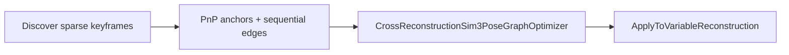

# Cross-run alignment extensions {#cross-run-alignment}

This chapter documents **pyTheia additions** for aligning two independent structure-from-motion reconstructions—typically a **fixed reference** (segment / map) and a **variable run**—into one coordinate frame. The code lives under:

- [`src/theia/sfm/bundle_adjustment/`](https://github.com/urbste/pyTheiaSfM/tree/master/src/theia/sfm/bundle_adjustment) — relative pose edges inside full BA  
- [`src/theia/sfm/transformation/`](https://github.com/urbste/pyTheiaSfM/tree/master/src/theia/sfm/transformation) — Sim(3) pose helpers and optional standalone pose-graph optimizer  

Python bindings are on **`pytheia.sfm`** (`import pytheia as pt` → `pt.sfm`).

!!! note "Two integration patterns"

    **BA-centric alignment** (anchor view priors + reprojection + optional odometry edges) uses `BundleAdjustReconstruction`, `BundleAdjustReconstructionWithRelativePoseEdges`, and view position/orientation priors. This is the path used by production run-to-segment pipelines that warp cameras in Python, retriangulate tracks, then refine in BA.

    **Standalone Sim(3) pose graph** (`AlignReconstructionsWithPoseGraph`, `CrossReconstructionSim3PoseGraphOptimizer`) optimizes sparse keyframe poses in a separate Ceres problem without reprojection residuals. It remains available for experimentation and tooling; see [Transformations → pose graph](transformations.md#transformations-pose-graph).

---

## What was added (summary) {#cross-run-summary}

| Feature | Python entry points | C++ core |
|---------|---------------------|----------|
| **SE(3) odometry edges in BA** | `RelativePoseConstraint`, `BundleAdjustReconstructionWithRelativePoseEdges` | [`relative_pose_error.h`](https://github.com/urbste/pyTheiaSfM/blob/master/src/theia/sfm/bundle_adjustment/relative_pose_error.h) |
| **Scale-invariant odometry edges** | `RelativePoseConstraint.scale_invariant_translation` + direction/magnitude weights | [`scaled_relative_pose_error.h`](https://github.com/urbste/pyTheiaSfM/blob/master/src/theia/sfm/bundle_adjustment/scaled_relative_pose_error.h) |
| **Control-point BA** | `BundleAdjustReconstructionWithConstantTracks` | [`bundle_adjustment.cc`](https://github.com/urbste/pyTheiaSfM/blob/master/src/theia/sfm/bundle_adjustment/bundle_adjustment.cc) |
| **Sim(3) pose from `View`** | `GetSim3LieFromView`, `RelativeSim3BetweenViews`, `SetViewCameraFromSim3Lie` | [`sim3_pose_from_view.h`](https://github.com/urbste/pyTheiaSfM/blob/master/src/theia/sfm/transformation/sim3_pose_from_view.h) |
| **Cross-reconstruction pose graph** | `AlignReconstructionsWithPoseGraph`, `CrossReconstructionSim3PoseGraphOptimizer`, constraint structs | [`cross_reconstruction_sim3_pose_graph_optimizer.h`](https://github.com/urbste/pyTheiaSfM/blob/master/src/theia/sfm/transformation/cross_reconstruction_sim3_pose_graph_optimizer.h) |
| **Shared anchor edge type** | `CrossViewAnchorEdge` | [`cross_reconstruction_pose_graph_types.h`](https://github.com/urbste/pyTheiaSfM/blob/master/src/theia/sfm/transformation/cross_reconstruction_pose_graph_types.h) |

Tests: [`pytests/sfm/relative_pose_constraint_test.py`](https://github.com/urbste/pyTheiaSfM/blob/master/pytests/sfm/relative_pose_constraint_test.py).

---

## Pose conventions {#cross-run-pose-conventions}

### World → camera SE(3)

Each estimated view stores a **camera center** \(\mathbf{c}\) in world coordinates and a world→camera rotation \(\mathbf{R}_{c\leftarrow w}\) (angle-axis in Ceres blocks). The implementation builds a Sophus pose

\[
\mathbf{g} = (\mathbf{R}_{c\leftarrow w},\; \mathbf{t}), \qquad \mathbf{t} = -\mathbf{R}_{c\leftarrow w}\,\mathbf{c},
\]

so a world point maps to the camera frame as \(\mathbf{x}_c = \mathbf{R}_{c\leftarrow w}\,(\mathbf{x}_w - \mathbf{c})\).

The **relative pose** from camera \(i\) to camera \(j\) used by odometry edges is

\[
\mathbf{g}_{j\leftarrow i} = \mathbf{g}_j\,\mathbf{g}_i^{-1}.
\]

At edge creation time this quantity is **snapshotted** from the current extrinsics. During BA it stays fixed while \(\mathbf{g}_i,\mathbf{g}_j\) are optimized, so the edge preserves the **local trajectory shape** present before the solve.

### Sim(3) from a view

For cross-reconstruction alignment, a camera pose is also represented as \(\mathrm{Sim}(3)\)

\[
\mathbf{x}_c = s\,\mathbf{R}_{c\leftarrow w}\,\mathbf{x}_w + \mathbf{t}_{c\leftarrow w}, \qquad \mathbf{t}_{c\leftarrow w} = -\mathbf{R}_{c\leftarrow w}\,\mathbf{c}.
\]

`GetSim3LieFromView(view)` returns the **7-vector Lie algebra coordinates** \(\boldsymbol{\xi} \in \mathbb{R}^7\) with Sophus convention \(\mathrm{Sim}(3) = \exp(\boldsymbol{\xi})\). The last component \(\sigma = \xi_6\) is the **log-scale**: \(s = e^\sigma\).

`RelativeSim3BetweenViews(view_i, view_j)` returns \(\log\!\left(\mathbf{S}_i^{-1}\mathbf{S}_j\right)\) where \(\mathbf{S}_k\) is the Sim(3) pose of view \(k\).

---

## Bundle adjustment: relative pose edges {#cross-run-ba-relative-edges}

`BundleAdjustReconstructionWithRelativePoseEdges` runs standard reconstruction BA (all estimated views and tracks, reprojection, optional position/orientation/gravity priors) and adds one Ceres residual per `RelativePoseConstraint`.

When relative edges are present, **`use_inner_iterations` is forced off** during setup because edges couple two camera blocks and break Ceres inner-iteration grouping assumptions.

### Standard SE(3) edge (`scale_invariant_translation = False`)

Given fixed measurement \(\hat{\mathbf{g}}_{j\leftarrow i}\) (snapshot at setup) and current poses \(\mathbf{g}_i,\mathbf{g}_j\), define

\[
\mathbf{E} = \mathbf{g}_{j\leftarrow i}\,\hat{\mathbf{g}}_{j\leftarrow i}^{-1}, \qquad \mathbf{g}_{j\leftarrow i} = \mathbf{g}_j\,\mathbf{g}_i^{-1}.
\]

The residual is the weighted Sophus \(\mathfrak{se}(3)\) logarithm (tangent order **translation first, rotation second**):

\[
\mathbf{r} = \mathbf{W}\,\log(\mathbf{E}) \in \mathbb{R}^6,
\]

with diagonal \(\mathbf{W}\) built from `translation_sqrt_weight` and `rotation_sqrt_weight` (units \(1/\mathrm{m}\) and \(1/\mathrm{rad}\)).

This stiffens **both** relative translation and rotation. It is appropriate when the run reconstruction already has a consistent metric scale.

### Scale-invariant translation edge (`scale_invariant_translation = True`)

Monocular / CoTracker runs can have **wrong global scale** after alignment warps while still having reliable **motion direction** between consecutive frames. `ScaledRelativePoseError` splits translation into:

1. **Rotation** (3 residuals): \(\mathbf{W}_R\,\log(\mathbf{E})_{1:3}\) — same \(\mathfrak{se}(3)\) rotation part as above.  
2. **Translation direction** (3 residuals): \(\mathbf{W}_{dir}\,(\hat{\mathbf{t}} \times \mathbf{t})\) where \(\mathbf{t},\hat{\mathbf{t}}\) are the translation components of \(\mathbf{g}_{j\leftarrow i}\) and \(\hat{\mathbf{g}}_{j\leftarrow i}\), normalized.  
3. **Translation magnitude** (1 residual, optional): \(\mathbf{W}_{mag}\,\log\!\left(\|\mathbf{t}\| / \|\hat{\mathbf{t}}\|\right)\).

Set `translation_magnitude_sqrt_weight = 0` to leave **scale along the chain free**; keep `translation_direction_sqrt_weight` and `rotation_sqrt_weight` positive to preserve local path shape.

Typical production pairing:

- **Strong position/orientation priors** on sparse anchor views (from PnP into the segment frame).  
- **Soft or no priors** on dense interpolated frames.  
- **Scale-invariant odometry edges** between consecutive (or windowed) run views.  
- **Inverse-depth track parametrization** (`use_inverse_depth_parametrization`) for better conditioning when many 3D points move with the cameras.

```python
import pytheia as pt

edge = pt.sfm.RelativePoseConstraint()
edge.view_id_i = vid_i
edge.view_id_j = vid_j
edge.rotation_sqrt_weight = 100.0
edge.scale_invariant_translation = True
edge.translation_direction_sqrt_weight = 30.0
edge.translation_magnitude_sqrt_weight = 0.0  # scale-free along chain

opts = pt.sfm.BundleAdjustmentOptions()
opts.use_position_priors = True
opts.use_orientation_priors = True
opts.use_inverse_depth_parametrization = True
opts.linear_solver_type = pt.sfm.LinearSolverType.SPARSE_SCHUR

summary = pt.sfm.BundleAdjustReconstructionWithRelativePoseEdges(
    opts, [edge], run_reconstruction
)
```

See also [Bundle adjustment → relative pose edges](bundle_adjustment.md#ba-relative-pose-edges).

### Control-point tracks

`BundleAdjustReconstructionWithConstantTracks` optimizes cameras and **variable** tracks but **does not** add parameter blocks for the listed track IDs. Reprojection residuals on those fixed map points still pull run cameras into the segment frame—useful when segment 3D points should not drift during run alignment.

---

## Standalone cross-reconstruction Sim(3) pose graph {#cross-run-pose-graph}

The pose graph optimizes a subset of **run keyframe** poses \(\mathbf{S}_k \in \mathrm{Sim}(3)\) (one 7-vector per keyframe) in a dedicated Ceres problem. **Segment** views referenced by anchors are held fixed via `set_fixed_reconstruction`. No reprojection terms are included.

### Variables

- \(\boldsymbol{\xi}_k \in \mathbb{R}^7\) per variable keyframe \(k\); \(\mathbf{S}_k = \exp(\boldsymbol{\xi}_k)\).  
- \(\sigma_k = \xi_{k,6}\) is optimized log-scale; bounds keep \(e^\sigma\) in a numerically safe range.

### Sequential Sim(3) edge (odometry)

For consecutive keyframes \(i,j\) with measured relative transform \(\hat{\mathbf{S}}_{j\leftarrow i}\) (from run odometry at setup), predict

\[
\mathbf{S}_{j\leftarrow i}^{\mathrm{pred}} = \mathbf{S}_i^{-1}\mathbf{S}_j.
\]

**Scale-free sequential residual** (`ScaleFreeSequentialSim3ErrorTerm`, 7 components):

| Block | Formula | Role |
|-------|---------|------|
| Rotation (3) | \(2\,\mathrm{Im}\!\left(\mathbf{q}(\mathbf{R}_{\mathrm{pred}}\hat{\mathbf{R}}^\top)\right)\) | Align relative rotation |
| Trans. direction (3) | \(\mathbf{t}_{\mathrm{pred}} \times \mathbf{t}_{\mathrm{meas}}\) (unit vectors) | Align motion direction, scale-free |
| Trans. magnitude (1) | \(\log\!\left(\|\mathbf{t}_{\mathrm{pred}}\| / (e^{\sigma_i}\,\|\mathbf{t}_{\mathrm{meas}}\|)\right)\) | Weak scale tie to per-frame \(\sigma_i\) |

Weighted by `sequential_weight` and optional `sequential_translation_magnitude_weight`.

### Cross-view anchor edge

`CrossViewAnchorEdge` stores a PnP target \(\hat{\mathbf{S}}_{\mathrm{run}\leftarrow \mathrm{seg}}\) for run view \(k\) expressed in the **segment** world frame, plus scalar `weight`.

**Absolute anchor residual** (`Sim3AbsoluteAnchorPoseErrorTerm`, 7 components) with \(\mathbf{E} = \hat{\mathbf{S}}^{-1}\mathbf{S}_k\):

- Rotation (3): weighted small-angle form from \(\mathbf{E}\).  
- Translation (3): \(\mathbf{W}\,\mathrm{translation}(\mathbf{E})\).  
- Log-scale (1): \(\mathbf{W}\,\log(\text{scale}(\mathbf{E}))\).

Huber loss on anchors is optional (`huber_delta_anchor`).

The struct is also used **outside** the pose-graph solver as a portable container for PnP results (e.g. converted to view position/orientation priors in BA).

### Scale smoothness

When `auto_scale_smoothness` is true, edges penalize \(\sigma_j - \sigma_i\) along consecutive keyframes in `variable_keyframe_view_ids` order, weighted by `scale_smooth_weight`. This discourages abrupt scale jumps along the run chain.

### Applying the solution

`apply_to_variable_reconstruction(variable_recon, transform_tracks=True)` writes optimized \(\boldsymbol{\xi}_k\) back to run views via `SetViewCameraFromSim3Lie`. When `transform_tracks` is true, each 3D point is updated by averaging per-observation Sim(3) deltas \(\boldsymbol{\Delta}_k = \mathbf{S}_k^{\mathrm{new}}(\mathbf{S}_k^{\mathrm{old}})^{-1}\) over views that observe the track.

Full API tables: [Transformations → pose graph](transformations.md#transformations-pose-graph).

---

## End-to-end workflows (sketch) {#cross-run-workflows}

### BA-centric (reprojection + priors + odometry)


Python application code typically lives outside pyTheia; pyTheia supplies PnP (`EstimateCalibratedAbsolutePose`), priors on `View`, track estimation, and `BundleAdjustReconstructionWithRelativePoseEdges`.

### Pose-graph-only



Use when you want a **lightweight** pose-only solve without touching 3D structure in the Ceres problem (tracks can still be warped afterward in a separate step).

---

## See also {#cross-run-see-also}

- [Bundle adjustment](bundle_adjustment.md) — options, priors, inverse depth, `BundleAdjuster`  
- [Transformations](transformations.md) — Umeyama, `AlignReconstructions`, Sim(3) point alignment  
- [Pose](pose.md) — absolute / relative pose estimators feeding PnP anchors  
- [SfM](sfm.md) — `Reconstruction`, `View`, `Track`  
