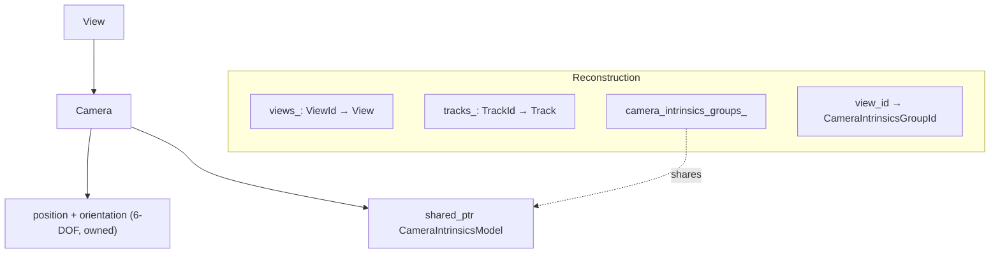
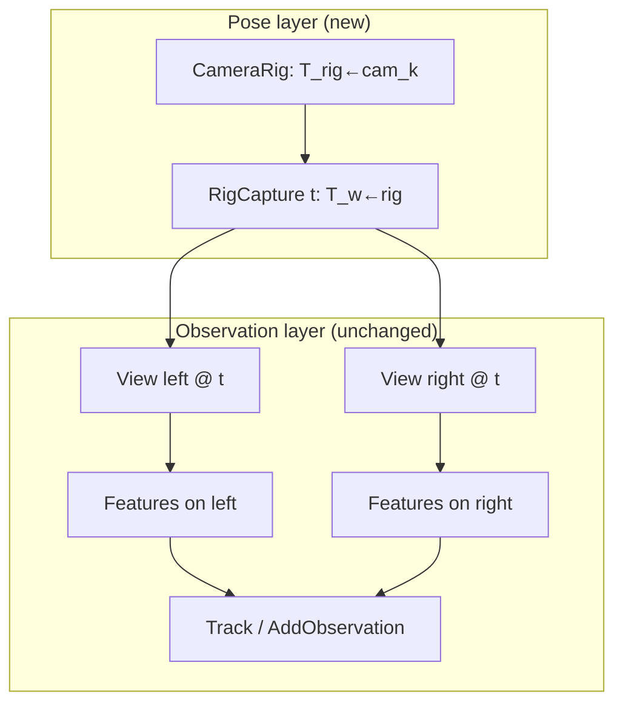

# Multi-camera / stereo rig support — design proposal

**Status:** proposal for review (no implementation in this PR)  
**Goal:** Reconstruct trajectories of stereo (and general N-camera) rigs, with optional estimation of inter-camera extrinsics, without large breaking changes to the existing Python/C++ API.

---

## 1. Current class structure (what we have today)

pyTheia’s SfM model is **monocular per View**. The shared-parameter pattern that already exists is **shared intrinsics only**.



| Class | Role | Pose? | Shared params? |
|-------|------|-------|----------------|
| `Reconstruction` | Owns Views, Tracks, intrinsics groups | — | Intrinsics groups |
| `View` | One image + observations + priors | Via owned `Camera` | No |
| `Camera` | Extrinsics (angle-axis + position) + intrinsics handle | **Yes, independent** | Intrinsics via `shared_ptr` |
| `Track` / `Feature` | 3D point / 2D observation | — | — |
| `ViewGraph` / `TwoViewInfo` | Match graph edges between Views | Relative R,t between Views | — |
| `BundleAdjuster` | Optimizes per-view extrinsics, points, group intrinsics | Per View | Intrinsics groups; soft `RelativePoseConstraint` edges |

**Key facts for rigs:**

1. **Each `View` = one independent camera pose.** There is no body/rig frame.
2. **`CameraIntrinsicsGroupId`** is the only first-class shared-parameter mechanism (good template to mirror for extrinsics).
3. **Timestamps must be unique** (`view_timestamp_to_id_`). Two synced stereo frames at the same timestamp cannot both be added without a hack (e.g. `t` and `t+ε`).
4. **`RelativePoseConstraint`** in BA is a *soft odometry/stiffening edge* between independent views — not a calibrated, shareable sensor baseline.
5. **Generalized-camera solvers exist** (`CameraAndFeatureCorrespondence2D3D`, rigid 2D–3D alignment, multi-origin relative pose) but sit **outside** the Reconstruction graph; they do not model a persistent rig.
6. **I/O** (binary Reconstruction, COLMAP export) assumes one pose per image; no multi-rig schema.

Relevant paths: `src/theia/sfm/reconstruction.h`, `view.h`, `camera/camera.h`, `bundle_adjustment/bundle_adjustment.h`, `estimators/camera_and_feature_correspondence_2d_3d.h`, Python surface in `src/pytheia/sfm/sfm.cc`.

---

## 2. Problem statement

We want to:

1. Define a **camera rig** (stereo or N sensors) with **relative extrinsics** \(T_{\text{rig}\leftarrow\text{cam}_k}\) (known, fixed, or jointly estimated).
2. Treat each synchronized multi-image capture as **one trajectory sample** (one body pose), not N independent cameras.
3. Keep **Views** as the observation unit (features still live on images) so matching / tracks / most of BA stay familiar.
4. Prefer **additive, backward-compatible** API changes: monocular workflows keep working unchanged.
5. Eventually support **stereo trajectory reconstruction** end-to-end (pose graph / SfM that respects the rig).

**Non-goals for v1:** full COLMAP multi-rig file parity, online SLAM, changing the Feature/Track observation model, rewriting Global/Incremental SfM from scratch in one shot.

---

## 3. Approaches considered

### Approach A — Soft relative-pose constraints only (minimal)

Keep today’s model. Represent left/right as independent Views. At BA time, add high-weight `RelativePoseConstraint`s (or new hard SE3 equality) between stereo pairs with known baseline.

| Pros | Cons |
|------|------|
| Almost no API change | Baseline is not a first-class, shareable parameter |
| Can try today with existing BA helpers | N views still have N free poses in estimators; easy to drift / over-parameterize |
| | Unique timestamp constraint remains awkward |
| | Extrinsics “estimation” is ad-hoc per pair, not one shared \(T_{L\leftarrow R}\) |
| | Trajectory is still N camera paths, not one rig path |

**Verdict:** Useful as a **temporary workaround**, insufficient as the product design.

### Approach B — Additive `CameraRig` layer (recommended)

Mirror `CameraIntrinsicsGroup`: add a **rig catalog** and **capture membership** on `Reconstruction`, without replacing `View`/`Camera`.

- `CameraRig` stores sensor slots + relative extrinsics + optional “optimize extrinsics” flags.
- Each `View` may optionally belong to a `(RigId, RigCameraId, CaptureId)`.
- **Canonical pose** for a capture is the **rig body pose**; each View’s `Camera` extrinsics are either derived from body ⊕ sensor offset, or kept as a cache that BA keeps consistent.
- Monocular Views simply have no rig membership (today’s behavior).

| Pros | Cons |
|------|------|
| Matches existing shared-intrinsics pattern | Two places to keep pose consistent (body vs `Camera` cache) unless carefully designed |
| Minimal breaking changes | Estimators need staged upgrades to use body poses |
| Extrinsics are first-class and sharable across all captures of a stereo pair | Slightly more bookkeeping than a greenfield redesign |
| Python can grow with optional methods | |
| Phased: data model → BA → localization → full SfM | |

**Verdict:** Best fit for pyTheia’s evolution style and “no big breaks” constraint.

### Approach C — First-class `RigCapture` as the pose atom

Replace (or demote) `View` pose: Reconstruction stores `Capture` objects with body poses; Views become observation-only attachments.

| Pros | Cons |
|------|------|
| Cleanest long-term semantics | Large API / serialization / estimator rewrite |
| One pose per timestamp by construction | Breaks existing code that mutates `View.Camera()` pose |
| | High risk for a first PR |

**Verdict:** Attractive as a possible **later consolidation** of Approach B once rig BA is proven — not the starting point.

---

## 4. Recommended design (Approach B)

### 4.1 New types

```text
RigId              // uint32_t, like ViewId
RigCameraId        // uint32_t, sensor slot within a rig (0 = reference / left)
CaptureId          // uint32_t, one synchronized multi-camera sample
```

```text
CameraRig
  name
  reference_camera_id          // body frame = this sensor, or an abstract body
  sensors: map<RigCameraId, RigSensor>
    RigSensor:
      name                     // e.g. "left", "right"
      T_rig_camera             // SE3: camera from rig (or camera-from-body)
      optimize_extrinsics      // bool; default false for calibrated stereo
      intrinsics_group_id      // optional link; usually one group per physical cam

RigMembership (per View, optional)
  rig_id
  rig_camera_id
  capture_id
```

### 4.1.1 Frame convention (yes: relative to a RIG coordinate system)

Sensor extrinsics are defined **in / relative to a shared rig (body) frame**, not relative to “the other camera” as a one-off:

\[
T_{w\leftarrow c_k} = T_{w\leftarrow\text{rig}} \, T_{\text{rig}\leftarrow c_k}
\]

| Transform | Meaning | Stored where |
|-----------|---------|--------------|
| \(T_{w\leftarrow\text{rig}}(t)\) | Rig pose at capture timestamp \(t\) (trajectory sample) | `RigCapture` |
| \(T_{\text{rig}\leftarrow c_k}\) | Fixed (or slowly calibrated) sensor pose in the **rig coordinate system** | `CameraRig::RigSensor` |
| \(T_{w\leftarrow c_k}(t)\) | Derived camera pose used for projection / I/O | Cached on `View::Camera` |

**Rig frame choice:** the rig CS is an explicit frame you pick when defining the rig. Common choices:

1. **Reference sensor** (typical stereo): left camera = identity \(T_{\text{rig}\leftarrow L}=I\), right = baseline \(T_{\text{rig}\leftarrow R}\).
2. **Abstract body** (IMU / vehicle / geometric center): every sensor has a non-identity offset; useful when fusing IMU later.

Stereo “left↔right relative pose” is then just composition of the two sensor offsets:

\[
T_{L\leftarrow R} = T_{\text{rig}\leftarrow L}^{-1}\, T_{\text{rig}\leftarrow R}
\]

(with \(T_{\text{rig}\leftarrow L}=I\) this collapses to \(T_{\text{rig}\leftarrow R}\)).

**Decision locked in:** one `RigCapture` = **one timestamp** = **one rig pose** \(T_{w\leftarrow\text{rig}}(t)\). All Views in that capture share that timestamp; uniqueness is on `(rig_id, timestamp)` / `CaptureId`, not on every View.

### 4.1.2 Features and matches — keep them on Views

Rigs change **pose ownership**, not the observation graph. Features and tracks stay **image-centric** (same as today).



**Features**

- Detect and store keypoints per **View** (per image / sensor), exactly as now: `View::AddFeature` / `Reconstruction::AddObservation`.
- A stereo pair at time \(t\) is two Views in one `RigCapture`; each has its own feature list.
- No “rig-level Feature” type in v1 — that would break Track/BA without buying much.

**Tracks (multi-view correspondences)**

- Still `TrackId` with observations `(ViewId, Feature)`.
- A 3D point seen in left and right at the same time is just a track with two observations in the same capture (different `RigCameraId`s) — valuable for **metric scale**.
- A point tracked over time may appear in many captures and sensors; TrackBuilder / `AddObservation` need no special API.

**Matches → ViewGraph (pairwise geometry)**

Matching remains **View ↔ View** (pyTheia already leaves matching to the application):

| Match type | Example | Role |
|------------|---------|------|
| Intra-capture (stereo) | left\(_t\) ↔ right\(_t\) | Known relative pose from rig; use for triangulation / scale / verification; optional ViewGraph edge marked as *rig-known* |
| Temporal, same sensor | left\(_t\) ↔ left\(_t+1\) | Primary motion edges |
| Temporal, cross sensor | left\(_t\) ↔ right\(_t+1\) | Extra constraints; relative pose = motion ∘ rig offsets |

**Recommended structure:**

1. **Keep `ViewGraph` as ViewId–ViewId** for v1. Add matches with `AddEdge(view_i, view_j, TwoViewInfo)` as today.
2. For **intra-rig pairs**, either:
   - skip estimating `TwoViewInfo` and **inject** the known \(T_{c_i\leftarrow c_j}\) from the `CameraRig`, or
   - estimate normally and **compare / replace** with the rig prior (calibration check).
3. Optionally tag edges (`TwoViewInfo` flag or side map) as `FROM_RIG_EXTRINSICS` vs `FROM_MATCHES` so estimators can trust stereo edges fully.
4. **Later (P3):** a thin `CaptureGraph` (CaptureId–CaptureId) can be *derived* by composing View edges with known sensor offsets — used by rotation/position averaging on the trajectory. Do **not** require users to match at capture level first.

**Python ingest sketch**

```python
# 1) Define rig CS + sensor offsets (relative to RIG frame)
rig_id = recon.AddCameraRig(stereo_rig)  # T_rig_left = I, T_rig_right = baseline

# 2) One capture = one timestamp = one rig pose slot
cap = recon.AddRigCapture(rig_id, t, {LEFT: "l.png", RIGHT: "r.png"})
v_l, v_r = recon.GetRigCapture(cap).view_ids[LEFT], ...

# 3) Features stay on views
for kp in left_keypoints:
    # via TrackBuilder or AddObservation after matching
    ...

# 4) Matches are still between views
matches_lr = match(left_desc, right_desc)          # stereo
matches_ll = match(left_t_desc, left_t1_desc)      # temporal

view_graph.AddEdge(v_l, v_r, two_view_from_rig(rig, LEFT, RIGHT))  # or from matches
view_graph.AddEdge(v_l_t, v_l_t1, two_view_from_matches(matches_ll))

# 5) Tracks from all match sets (TrackBuilder across ViewIds)
```

**What we deliberately do *not* do in v1**

- Replace ViewGraph vertices with captures (too breaking for matching code).
- Store features on the `CameraRig` or `RigCapture`.
- Require users to only match left–left (though that remains a valid simplified pipeline).

### 4.2 Reconstruction API (additive)

Keep all existing methods. Add:

```cpp
RigId AddCameraRig(const CameraRig& rig);
const CameraRig* GetCameraRig(RigId) const;
CameraRig* MutableCameraRig(RigId);

CaptureId AddCapture(RigId rig_id, double timestamp);
// Associates an existing View with a sensor slot in a capture.
bool SetViewRigMembership(ViewId, RigId, RigCameraId, CaptureId);

// Convenience for stereo / N-cam ingest:
CaptureId AddRigCapture(
    RigId rig_id,
    double timestamp,
    const std::map<RigCameraId, std::string>& camera_id_to_view_name);
```

**Timestamp policy (compatibility):**

- **Locked:** one capture ↔ one timestamp ↔ one rig pose.
- Uniqueness is on **`(rig_id, timestamp)`** for captures. Member Views **share** that timestamp.
- Monocular `AddView` keeps today’s per-View uniqueness for backward compatibility until a version bump.

**Serialization:** bump `CEREAL_CLASS_VERSION(Reconstruction)` and `View`; old files load as “no rigs”.

### 4.3 Where the body pose lives

**Recommendation:** store body pose on a small `RigCapture` object owned by `Reconstruction`:

```text
RigCapture
  capture_id, rig_id, timestamp
  is_estimated
  orientation (aa), position   // body / reference frame
  view_ids: map<RigCameraId, ViewId>
```

On set / after BA:

1. Optimize `RigCapture` pose (+ optional shared `CameraRig` extrinsics).
2. **Propagate** to each member `View::Camera` extrinsics so existing projectors, I/O, and monocular code keep working.

This avoids changing every call site that reads `view->Camera().GetPosition()`.

Views **without** membership behave exactly as today (pose only on `Camera`).

### 4.4 Bundle adjustment

Extend `BundleAdjuster` with a rig mode (default off):

| Parameter block | When |
|-----------------|------|
| One 6-DOF per `RigCapture` | View is in a rig |
| Shared `T_rig_camera` per `RigSensor` | `optimize_extrinsics == true` |
| Per-view 6-DOF | View not in a rig (current behavior) |
| Intrinsics groups | Unchanged |
| Tracks | Unchanged |

Reprojection residual for a rigged view uses composed pose \(T_{w\leftarrow c} = T_{w\leftarrow\text{rig}} T_{\text{rig}\leftarrow c}\) (Ceres `ProductManifold` / custom cost, or local parameterization that writes through to the View camera cache after `Solve`).

**Gauge / stereo scale:** With a fixed baseline and cross-camera tracks, metric scale is recoverable. If extrinsics are free without prior, add a soft prior on baseline length or hold one translation component fixed.

**Do not overload** `RelativePoseConstraint` for calibrated rigs — keep that for odometry. Rigs use shared extrinsics parameters instead.

**Rig frame choice:** the default is an **abstract body frame** whose pose is the trajectory sample. It is initialized to **identity** in the world for the first capture. Sensors are **not** required to include a camera at the body origin — each stores its calibrated pose in that abstract rig CS (stereo left/right both offset from body, or left coincidentally at identity if you choose).

### 4.5.1 `IncrementalRigReconstructor` (v1 pipeline)

Prefer a dedicated incremental **rig** reconstructor over overloading `IncrementalReconstructionEstimator`:

```text
IncrementalRigReconstructor::Estimate(ViewGraph*, Reconstruction*)
  1. SeedCapture:
       - Pick earliest capture (by timestamp) with enough intra-rig tracks
       - Set RigCapture pose = Identity (abstract body)
       - PropagateViewCamerasFromCapture()
       - Triangulate tracks observed by ≥2 estimated cameras in this capture
         (intra-rig: known metric baseline → scale for free)
  2. While unestimated captures remain:
       - Pick next capture with enough 2D–3D correspondences to the map
       - LocalizeCapture:
           Prefer EstimateRigidTransformation2D3D with cameras posed in the
           rig frame (all sensors) → T_world←rig
           Fallback: LocalizeViewToReconstruction on one view, then
           T_world←rig = T_world←cam ∘ T_rig←cam^{-1}
       - PropagateViewCamerasFromCapture()
       - Triangulate new tracks (intra-rig + temporal)
       - Optional partial / full BundleAdjustReconstruction, then
         re-propagate from optimized body (views stay consistent with rig)
```

**Why incremental-first:** triangulation between cameras of the same capture is the easy, metric case; pose from capture \(t\) to \(t+1\) is then standard map localization (generalized absolute pose) rather than a fragile two-view + scale dance. A later `RigReconstructionBuilder` can wrap matching ingest + this reconstructor the way `ReconstructionBuilder` wraps the monocular estimators.

**Triangulation:** reuse `TrackEstimator` / `Triangulate*` after camera poses are propagated — no separate “rig triangulation” type. Intra-rig matches simply become 2-view (or N-view) tracks whose cameras already have correct relative geometry.

### 4.6 Python API sketch (non-breaking)

```python
import pytheia as pt

rig = pt.sfm.CameraRig()
rig.set_name("stereo")
left = rig.add_sensor("left", T_rig_left)      # often identity
right = rig.add_sensor("right", T_rig_right)  # known baseline
right.set_optimize_extrinsics(False)

recon = pt.sfm.Reconstruction()
rig_id = recon.AddCameraRig(rig)

cap = recon.AddRigCapture(
    rig_id, timestamp,
    {left: "frame_0001_left.png", right: "frame_0001_right.png"},
)
# Views exist; Camera extrinsics derived from capture body pose.

opts = pt.sfm.BundleAdjustmentOptions()
opts.use_rig_constraints = True
pt.sfm.BundleAdjustReconstruction(opts, recon)

# Trajectory samples:
for cid in recon.CaptureIds(rig_id):
    pose = recon.GetRigCapture(cid)  # position / orientation of body
```

Existing monocular scripts that only call `AddView` / estimators remain valid.

### 4.7 I/O

- Binary Reconstruction: versioned cereal fields for rigs/captures/membership.
- COLMAP export (later): either export expanded per-image poses (compatible today) or map to COLMAP’s `rigs` / `frames` when targeting newer COLMAP.
- Optional helper: `WriteRigTrajectory(rig_id, path)` — TUM/KITTI-style body poses for stereo odometry eval.

### 4.8 Modular file layout

Keep new code isolated; do not explode `reconstruction.h` with all logic:

```text
src/theia/sfm/rig/
  camera_rig.h / .cc          # CameraRig, RigSensor, SE3 offsets
  rig_capture.h / .cc         # RigCapture body pose
  rig_utils.h / .cc           # Compose/propagate poses, stereo helpers
src/theia/sfm/bundle_adjustment/
  ...                         # rig residual paths in BundleAdjuster
src/pytheia/sfm/
  ...                         # bindings + stubs
docs/content/rigs.md          # user-facing chapter (after implementation)
```

`Reconstruction` holds maps and thin accessors; pose math lives in `rig_utils`.

---

## 5. Compatibility contract

| Existing behavior | Change? |
|-------------------|---------|
| `AddView` / View / Camera / Track / Feature | Unchanged for monocular |
| Intrinsics groups | Unchanged |
| `ReconstructionEstimator` without rigs | Unchanged |
| BA without `use_rig_constraints` | Unchanged |
| Unique view timestamps | Kept for monocular `AddView`; relaxed for Views in the same `CaptureId` |
| Cereal load of old reconstructions | Must succeed (empty rig maps) |
| Python import `pytheia as pt` | Additive symbols only in v1 |

Breaking changes (if any) should be limited to intentional timestamp policy cleanup and documented in a migration note.

---

## 6. Success criteria (stereo trajectory)

A user can:

1. Construct a 2-camera `CameraRig` with known \(T_{L\leftarrow R}\).
2. Ingest a sequence of stereo pairs as `RigCapture`s (shared timestamp).
3. Run matching + an initial pose path (monocular-on-left or custom).
4. Bundle-adjust with rig constraints and obtain a **single metric trajectory** (body poses) plus consistent left/right cameras.
5. Optionally set `optimize_extrinsics=True` to refine the baseline with a prior.

---

## 7. Open decisions (defaults proposed)

| Question | Proposed default | Status |
|----------|------------------|--------|
| Body frame = which sensor? | **Abstract body** at identity (sensors carry offsets into that CS) | **Locked** |
| Extrinsics convention | Sensor pose in **rig CS**, same convention as `Camera` (center in rig + rig→camera rotation) | **Locked** |
| Optimize extrinsics by default? | **No** (calibrated stereo); opt-in per sensor | Open |
| Store body pose where? | `RigCapture` on `Reconstruction`, propagate to `View.Camera` | **Locked** |
| Features / matches | On **Views**; `ViewGraph` stays View–View; optional later `CaptureGraph` | **Locked** |
| Extrinsic optimization during averaging? | **No** — calibrated rigs only for now | **Locked** |
| Global reconstructor | **`GlobalRigReconstructor`** (MGSfM-inspired; Theia averaging backends selectable) | **Locked** |
| Full SfM rewrite in first implementation? | **No** — data model + incremental rig reconstructor | Open |
| Timestamp uniqueness | **One capture = one timestamp = one rig pose** | **Locked** |

---

## 8. Suggested implementation order

1. Spec approval (this document).
2. **P0:** C++ `CameraRig` / `RigCapture` + Reconstruction maps + cereal + pybind + unit tests (pose compose/propagate).
3. **P1:** Rig-aware BA + stereo trajectory pytest on a synthetic/fixed-baseline scene.
4. **P2:** Capture localization via existing generalized 2D–3D estimators.
5. **P3:** Capture-level ViewGraph / estimator integration + docs example (`pyexamples/stereo_rig_trajectory.py`).

---

## 9. Summary

The library already has the right *pattern* for shared parameters (`CameraIntrinsicsGroup`) and some *solvers* for multi-camera geometry, but the **Reconstruction graph is still one pose per View**. The lowest-breakage path is an **additive rig layer**: `CameraRig` + `RigCapture` + optional View membership, BA that optimizes body poses (and optionally shared extrinsics), and phased estimator upgrades. Monocular APIs stay the default; stereo trajectories become a first-class, modular extension rather than a soft-constraint hack or a full rewrite of `View`.
